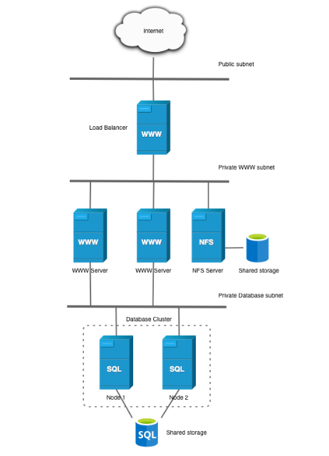

# **Práctica 9 INSTALACIÓN DE WORDPRESS EN DISTINTOS NIVELES**

En está practica vamos a instalar wordpress en diferentes niveles:

* **Fase 0** 

*Instalaremos el wordprees con solamente un nodo.*

* **Fase 1** 

*En esta fase, usaremos dos máquinas que tendrán dos niveles distintos una es el front-end(que tendrá wordpress y apache) y el back-end(que le servirá la base de datos al front-end).*

* **Fase 2** 

**La siguiente fase constará de 5 máquinas:**

*La primera capa, pondremos un balanceador que nos permitirá comunicar con lás máquinas que hay en las capas inferiores)*   

*La segunda capa, tiene 3 niveles font-end (dos que servirán como servidor apache, y un servidor nfs que contestará a las peticiones que les realice apache, es decir, está maquina tendrá wordpress, entonces cada vez que alguien se quiera conectar al wordpress el servidor de apache preguntará al servidor nfs para que esa respuesta llegue finalmente al balanceador).*

*La tercera capa es el back-end , la máquina que está en este nivel nos dará la base de datos y con un usuario para wordpress.*


**Importante la máquina back-end tiene que tener el puerto 3306 y el servidor nfs el puerto 2049**




## **FASE 0**

Instalaremos todo lo necesario para tener en una única máquina wordpress.

**Nos vamos al archivo de las variables.**

```yml
---
DB_HOST_PRIVATE_IP: localhost
DB_NAME: db_name
DB_USER: db_user
DB_PASS: db_pass

WP_HOME: https://prac9dmpasir.ddns.net
WP_SITEURL: https://prac9dmpasir.ddns.net/wordpress

EMAIL: chema51226@gmail.com
DOMAIN: prac9dmpasir.ddns.net


php_paquetes:
  - php
  - libapache2-mod-php 
  - php-mysql
```

La primera primera variables hay que poner la ip privada de la máquina que tenga la base de datos (back-end).

DB_NAME, DB_USER, DB_PASS son variables para la base de datos , donde diremos la base de datos, usuario y contrasseña.

WP_HOME es la url que utilizan los clientes.
WP_SITEURL es la url que utilizarán los administradores para configurar y demás wordpress.

EMAIL (CORREO) y DOMAIN (DOMINIO) son las variables para obtener el certificado.

La última variable es php_paquetes tiene una lista de contenido para que nos descargue a la vez los paquetes.


**Nos vamos a la pila lamp.**
```yml
---
- name: Playbook para instalar la pila lamp
  hosts: front
  become: yes

  tasks:

  - name: Añadimos las variables
    ansible.builtin.include_vars:
      ./variables.yml

  - name: Actualizar los repositorios
    apt:
      update_cache: yes

  - name: Instalar el servidor web Apache
    apt:
      name: apache2
      state: present

  - name: Instalar el servidor mysql
    apt:
      name: mysql-server
      state: present

  - name: Instalar PHP 
    apt:
      name: "{{php_paquetes}}"
      state: present

#-------------------------------------------------------------------

  - name: Eliminamos los archivos clonados innecesarios.
    file:
      path: /etc/apache2/sites-available/000-default.conf


  - name: Clonamos el repositorio
    git:
      repo: https://github.com/Daniel-Magana512/practica9V.git
      dest: /tmp/archivos

  - name: Movemos los archivos de configuración a /etc/apache2/sites-availeble
    copy:
      src: /tmp/archivos/fase0/conf/000-default.conf
      dest: /etc/apache2/sites-available/
      remote_src: yes

  - name: Movemos el dir.conf
    copy:
      src: /tmp/archivos/fase0/conf/dir.conf
      dest: /etc/apache2/mods-available
      remote_src: yes


  - name: Eliminamos los archivos clonados innecesarios.
    file:
      path: /tmp/archivos

#--------------------------------------------------------------

  - name: Instalamos el módulo rewrite
    apache2_module:
        name: rewrite
        state: present

  - name: Reiniciamos el servidor apache
    service:
      name: apache2
      state: restarted 
```


Añadimos el archivo de las variables.

Instalamos mysql-server, php, y apache.

Clonamos este mismo repositorio, para añadir el dir.conf y el 000-default.conf.

Instalamos el módulo de apache rewrite para wordpress.

Reiniciamos apache.

**Obtenemos el certificado**

```yml
---
- name: Playbook para instalar cerbot
  hosts: front
  become: yes

  tasks:
  

  - name: Añadimos las variables
    ansible.builtin.include_vars:
      ./variables.yml

  - name: Instalación de cerbot mediante snap
    community.general.snap:
      name: certbot
      classic: true
      state: present

  - name: Descarga el certificado 
    ansible.builtin.command: certbot --apache -m {{EMAIL}}  --agree-tos --no-eff-email -d {{DOMAIN}}
    register: my_output
    changed_when: my_output.rc !=0

  - name: Reinicamos apache2
    service: 
      name: apache2
      state: restarted
```

**Creamos la base de datos e instalamos Wordpress**


```yml
---
- name: Playbook para instalar la pila wordpress
  hosts: front
  become: yes

  tasks:

  - name: Añadimos las variables
    ansible.builtin.include_vars:
      ./variables.yml

  - name: Instalamos el gestor de paquetes de Python3
    apt:
      name: python3-pip
      state: present

  - name: Instalamos el modulo de pymysql
    pip:
      name: pymysql
      state: present

  - name: Crear una base de datos
    mysql_db:
      name: "{{ DB_NAME }}"
      state: present
      login_unix_socket: /var/run/mysqld/mysqld.sock

  - name: Creamos un usuario para la Base de datos
    no_log: true
    mysql_user:
      name: "{{ DB_USER }}"
      host: '%'
      password: "{{ DB_PASS }}"
      priv: "{{ DB_NAME }}.*:ALL,GRANT"
      state: present
      login_unix_socket: /var/run/mysqld/mysqld.sock

  - name: Reiniciamos el servidor mysql
    service:
      name: mysql
      state: restarted 


  - name: Instalar unzip
    apt:
      name: unzip
      state: present

  - name: Descargar WordPress 
    ansible.builtin.get_url:
      url: https://wordpress.org/latest.zip
      dest: /tmp/wordpress.zip

  - name: Descompresión de WordPress en /var/www/html
    ansible.builtin.unarchive:
      src: /tmp/wordpress.zip
      dest: /var/www/html
      remote_src: true

  - name: COpiamos el archvio de configuración de ejemplo y creamos uno
    copy:
      src: /var/www/html/wordpress/wp-config-sample.php
      dest: /var/www/html/wordpress/wp-config.php
      remote_src: yes

  - name: configuramos las variables en el archivo de configuración
    ansible.builtin.replace:
      path: /var/www/html/wordpress/wp-config.php
      regexp: database_name_here
      replace: "{{DB_NAME}}"

  - name: configuramos las variables en el archivo de configuración
    ansible.builtin.replace:
      path: /var/www/html/wordpress/wp-config.php
      regexp: username_here
      replace: "{{DB_USER}}"

  - name: configuramos las variables en el archivo de configuración
    ansible.builtin.replace:
      path: /var/www/html/wordpress/wp-config.php
      regexp: password_here
      replace: "{{DB_PASS}}"

  - name: configuramos las variables en el archivo de configuración
    ansible.builtin.replace:
      path: /var/www/html/wordpress/wp-config.php
      regexp: localhost
      replace: "{{DB_HOST_PRIVATE_IP}}"


  - name: Copiamos el archivo index.php del directorio wordpress
    copy:
      src: /var/www/html/wordpress/index.php
      dest: /var/www/html/index.php
      remote_src: yes

  - name: Modificación del archivo wp-config.php
    ansible.builtin.blockinfile:
      path: /var/www/html/wordpress/wp-config.php
      insertafter: DB_COLLATE
      block: |
        define('WP_HOME', '{{ WP_HOME }}');
        define('WP_SITEURL', '{{ WP_SITEURL }}');

  - name: Modificación del archivo index.php para la redirección a WordPress
    ansible.builtin.replace:
      path: /var/www/html/index.php
      regexp: wp-blog-header.php
      replace: wordpress/wp-blog-header.php

  - name: Cambiamos  de propietario y grupo de forma recursiva al directorio /var/www/html
    ansible.builtin.file:
      path: /var/www/html
      owner: www-data
      group: www-data
      recurse: true

  - name: Reiniciamos el servidor apache
    service:
      name: apache2
      state: restarted 

```

Creamos una base de datos, un usuario y contraseña.

Descargamos wordpress, lo descomprimimos y lo llevamos a /var/www/html.

Las variables de wordpress las asignaremos al archivo wp-config.php (este archivo previamente estaba dentro de la carpeta wordpress y se llamaba wp-config-sample.php, ahora lo hemos ubicado en /var/www/html)

Además de meter variables como la ip de donde se ubica la base de datos (en este caso en vez de poner la ip puse localhost, se ubica en la misma máquina), insertamos las url que he mencionado antes.

Modificamos el archivo index.php la linea wp-blog-header.php por wordpress/wp-blog-header.php, esto nos permitirá la reedireción.

Cambiamos los permisos y reiniciamos apache.

### **Archivos de configuración**

**000-default.conf**

Al añadir la siguiente directiva al 000-default.conf , nos permiste sobrescribir las reglas de apache.

```conf
<VirtualHost *:80>
        #ServerName www.example.com
        ServerAdmin webmaster@localhost
        DocumentRoot /var/www/html

      <Directory "/var/www/html">
         AllowOverride All
      </Directory>  

        ErrorLog ${APACHE_LOG_DIR}/error.log
        CustomLog ${APACHE_LOG_DIR}/access.log combined
</VirtualHost>
```
**dir.conf**

Modificamos el index.html y ponemos como prioridad index.php, para que la máquina coja priorida.

```conf
<IfModule mod_dir.c>
	DirectoryIndex index.php index.cgi index.pl index.html index.xhtml index.htm
</IfModule>
```

## **FASE 1**

Para esta fase necesitaremos dos máquina , una para el front-end y otra para el back-end.

* **La máquina de front-end tendra: Servidor apache y wordpress.**

* **La máquina de back-end tendrá la base de datos.**

El archivo de las variables no cambia, tampoco cambia la forma de obtener el certificado ni el archivo install_frontend.yml, además tiene los mismos archivos de configuración (000-default.conf y el dir.conf van a la máquina front-end es lo único nuevo), por lo tanto no lo volveré a explicar.

El archivo de wordpress es el mismo que la fase0, a excepción de mysql configuración de base de datos , usuario y contraseña, esto se debe a que la esta funcionalidad ya no está concentrada en una sola sino que concretamente esa labor se encargará el back-end.

**Instalamos mysql-server y configurar las conexiones**

Esta parte la tendremos que ejecutar al back-end, ya que es la máquina que tendrá la basse de datos y l máquina del front-end se comunicará con el back-end para obtener la información de la base de datos.

```yml
---
- name: Playbook para instalar la pila backend
  hosts: bak
  become: yes

  tasks:
  - name: Actualizar los repositorios
    apt:
      update_cache: yes

  - name: Instalar el sistema gestor de base de datos de mysql
    apt:
      name: mysql-server
      state: present
      
  - name: Cambiamos las variables de mysql para que me accepte conexiones desde cualquier interfaz
    ansible.builtin.replace:
      path: /etc/mysql/mysql.conf.d/mysqld.cnf
      regexp: 127.0.0.1
      replace: 0.0.0.0

  - name: Reiniciamos el servidor mysql
    service:
      name: mysql
      state: restarted 
```

Actualizamos los repositorios.

Instalamos mysql y dentro de la ruta  /etc/mysql/mysql.conf.d/mysqld.cnf
el archivo final, le cambiamos el 127.0.0.1 le pondremos 0.0.0.0 para que así pueda conectarse con otrás maquinas, si esto lo dejamos por defecto solo podrá comunicarse consigo misma.

Reiciniamos mysql.

```yml
---
- name: Playbook para instalar la pila backend
  hosts: bak
  become: yes

  tasks:

    - name: Añadimos las variables
      ansible.builtin.include_vars:
        ./variables.yml

    - name: Instalamos el gestor de paquetes de Python3
      apt:
        name: python3-pip
        state: present

    - name: Instalamos el modulo de pymysql
      pip:
        name: pymysql
        state: present

    - name: Crear una base de datos
      mysql_db:
        name: "{{ DB_NAME }}"
        state: present
        login_unix_socket: /var/run/mysqld/mysqld.sock

    - name: Creamos un usuario para la Base de datos
      no_log: true
      mysql_user:
        name: "{{ DB_USER }}"
        host: '%'
        password: "{{ DB_PASS }}"
        priv: "{{ DB_NAME }}.*:ALL,GRANT"
        state: present
        login_unix_socket: /var/run/mysqld/mysqld.sock

    - name: Reiniciamos el servidor mysql
      service:
        name: mysql
        state: restarted 
```

Hacemos un llamamiento a las variables para crear la base de datos, usuario y contraseña, aunque previamente instalamos el gestor de paquetes python3-pip para instalar pymysql, esta herramienta nos permitirá interactuar con la base de datos.

## **FASE 2**

**Recordar**

La primera capa, pondremos un balanceador que nos permitirá comunicar con lás máquinas que hay en las capas inferiores)   

La segunda capa, tiene 3 niveles font-end (dos que servirán como servidor apache, y un servidor nfs que contestará a las peticiones que les realice apache, es decir, está maquina tendrá wordpress, entonces cada vez que alguien se quiera conectar al wordpress el servidor de apache preguntará al servidor nfs para que esa respuesta llegue finalmente al balanceador).

La tercera capa es el back-end , la máquina que está en este nivel nos dará la base de datos y con un usuario para wordpress.


### **ARCHIVOS DE CONFIGURACIÓN**

Además de los archivos mencionados anteriormente

